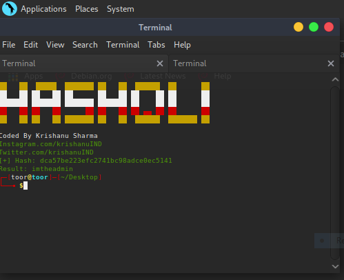
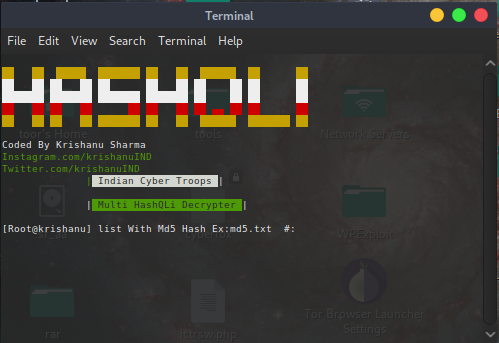

# HashQLi
HashQLi is tool to Decrypt Md5 hash Easily 
Fastest Tool To Decrypt MD5 Hash

Desined For Decrypt Md5 Hash You Get During Sql Injection
it will Decrypt Hashes R/t Sql Injection And Normal MD5 hashes
 <p>
 <a href="https://www.youtube.com/c/indiancybertroops">
    
  </a>
    <a href="https://instagram.com/indiancybertroops">
    
  </a>
     <a href="https://t.me/indiancybertroops">
    
  </a>

</p>
   
   


### Team Indian Cyber Troops:
>Created By : Krishanu Sharma 

# Features:
Easy to Install
Easy to Use
Designed In Bash(shell scripting)
Easy To Execue
Fastest Decryper
Low Bandwith/Data Consume
# Main HashQLi Image

# Installation :
> clone via git clone

```
git clone https://github.com/indiancybertroops/HashQLi
```
```
cd HashQLi
```
```
chmod +777 *
```
```
bash main
```

#Single HashQLi Image


## Commands To Execute Single Hash Deceypter (separatey)
> As Your Comfort
```
chmod +777 *
```
```
bash SingleHashQLi
```
# Multi HashQLi Image


## Commands To Execute Multi Hash Deceypter (separatey)
> As Your Comfort
```
chmod +777 *
```
```
bash MultiHashQLi
```

# Github Status
[](https://github.com/indiancybertroops "Stats")<br>

## Contact Us: 


>Instagram
https://instagram.com/krishanuIND


>Twitter
https://twitter.com/krishanuIND


>Github
https://github.com/indiancybertroops
